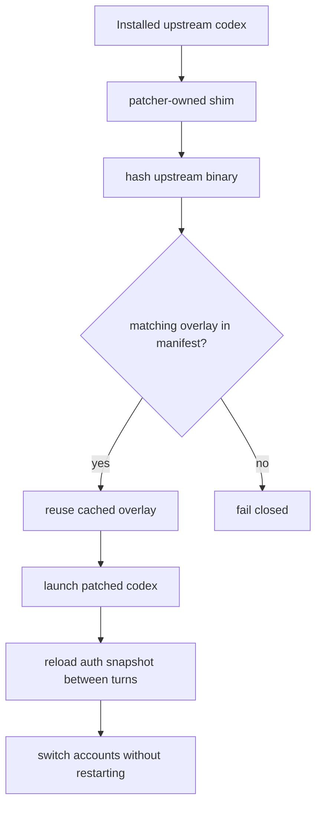
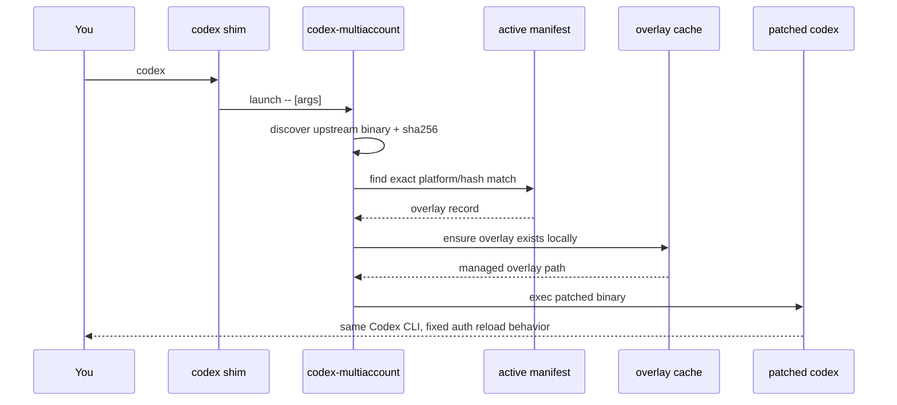
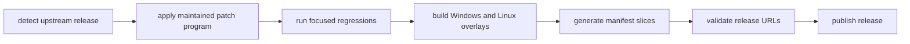
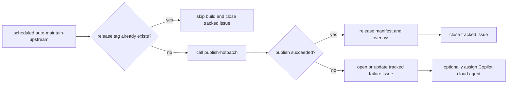

<div align="center">
  <p>
    
  </p>
  <h1>codex-multiaccount-patcher</h1>
  <p><strong>Patch Codex once, keep account switching seamless across turns.</strong></p>
  <p>
    <a href="https://github.com/minanagehsalalma/codex-multiaccount-patcher/releases/latest"></a>
    <a href="https://github.com/minanagehsalalma/codex-multiaccount-patcher/blob/main/LICENSE"></a>
    <a href="https://nodejs.org/"></a>
    <a href="https://github.com/minanagehsalalma/codex-multiaccount-patcher"></a>
    <a href="https://github.com/minanagehsalalma/codex-multiaccount-patcher/actions/workflows/publish-hotpatch.yml?query=branch%3Amain"></a>
    <a href="https://github.com/minanagehsalalma/codex-multiaccount-patcher/actions/workflows/compatibility-sweep.yml?query=branch%3Amain"></a>
  </p>
</div>

`codex-multiaccount-patcher` is now a single toolkit: it keeps a patched `codex` binary in front of the upstream install and bundles the `codex-auth` account manager behind the same install. The point is still narrow and practical: switch accounts cleanly, auto-switch when thresholds are hit, and let Codex pick up auth changes between turns without making you rebuild locally or restart the CLI.

## Flight Path



That is the whole shape of the project: discover the real upstream binary, match it by exact hash, hydrate the right overlay, then launch the patched executable through a shim the patcher controls.

## Quickstart

1. Install Codex normally first. The toolkit expects an existing global `@openai/codex` install.
2. Install the toolkit itself:

```bash
npm install -g github:minanagehsalalma/codex-multiaccount-patcher
```

3. Install the managed Codex shims and pull the latest validated manifest:

```bash
codex-multiaccount install
```

4. Check the patched Codex runtime:

```bash
codex-multiaccount status
```

5. Check the bundled auth toolkit:

```bash
codex-multiaccount auth status
codex-multiaccount auth list
```

After that, plain `codex` should route through the managed shim automatically. `codex-auth` is also installed as a compatibility alias, and the legacy alias `codex-hotpatch` still works during the transition.

## What Happens When You Type `codex`



<details>
<summary><strong>What install writes to the machine</strong></summary>

The patcher creates a managed home at `~/.codex-multiaccount`, stores overlay binaries under `overlays/`, writes the active manifest under `manifests/`, and places shims under `bin/`. It does not mutate the vendor Codex binary in place.

</details>

<details>
<summary><strong>Why updates survive better than direct patching</strong></summary>

When upstream Codex changes, the patcher hashes the new binary on the next launch and looks for a matching published overlay. If one exists, it switches cleanly. If one does not, it fails closed instead of silently launching a stale or mismatched binary.

</details>

<details>
<summary><strong>Why the release pipeline matters</strong></summary>

The runtime stays simple because the heavy work moves to CI: apply the maintained patch program, run the two focused regressions, build the overlays, generate the manifest, and only then publish a release that the CLI can consume.

</details>

## Release Pulse



The automation is designed to stop before publishing when the patch program drifts, a regression breaks, or the manifest points at the wrong repo/tag. That last check exists specifically to prevent the kind of release cleanup that makes a public release page look sloppy.

## Unattended Maintenance Loop



The green path is now zero-touch: detect the latest upstream Codex release, skip work if the matching patch release already exists, otherwise run the existing publish pipeline and close any tracked failure issue after success. Human attention is only pulled in when the deterministic path fails closed.

## Command Surface

| Command | Purpose |
| --- | --- |
| `codex-multiaccount install [--overlay-path <path>] [--manifest <file-or-url>] [--path <upstream-binary>] [--force]` | Install shims, discover upstream Codex, and materialize the matching overlay |
| `codex-multiaccount status` | Show upstream hash, active overlay, manifest source, and install health |
| `codex-multiaccount repair` | Re-resolve the manifest and refresh the managed runtime |
| `codex-multiaccount uninstall` | Remove the managed runtime and restore normal `codex` launch behavior |
| `codex-multiaccount launch -- [codex args...]` | Internal entrypoint used by the managed shims |
| `codex-multiaccount auth <codex-auth args...>` | Run the bundled auth toolkit through the same install |
| `codex-multiaccount list` | Convenience alias for `codex-multiaccount auth list` |
| `codex-multiaccount login [--device-auth]` | Convenience alias for `codex-multiaccount auth login` |
| `codex-multiaccount switch [<query>]` | Convenience alias for `codex-multiaccount auth switch` |
| `codex-multiaccount remove ...` | Convenience alias for `codex-multiaccount auth remove` |
| `codex-multiaccount import ...` | Convenience alias for `codex-multiaccount auth import` |
| `codex-multiaccount clean` | Convenience alias for `codex-multiaccount auth clean` |
| `codex-multiaccount config ...` | Convenience alias for `codex-multiaccount auth config` |
| `codex-auth ...` | Backward-compatible shim to the bundled auth toolkit |

Normal users should usually need `install`, `status`, `auth status`, `auth list`, and `switch`.

## Auth Toolkit

The bundled auth engine is the same native `codex-auth` toolchain, now shipped behind this package so users do not have to install and coordinate a second CLI manually.

If a working standalone `codex-auth` install already exists on the machine, the toolkit reuses it first so existing tuned behavior and account state keep working. Fresh installs fall back to the bundled auth engine automatically.

```bash
codex-multiaccount auth status
codex-multiaccount auth list
codex-multiaccount switch work
codex-multiaccount config auto --5h 10 --weekly 1
```

The compatibility alias still works too:

```bash
codex-auth status
codex-auth list
```

## Maintained Patch Model

The repo no longer depends on hand-refreshing one giant patch for every Codex release. The durable part is a small patch program plus two regressions that prove the behavior still works.

| Layer | Role |
| --- | --- |
| [src/lib/maintained-patch.js](src/lib/maintained-patch.js) | Applies the runtime rewrite logic |
| [patches/codex-hot-reload-tests.patch](patches/codex-hot-reload-tests.patch) | Carries the smaller fallback test changes |
| `current_client_setup_reloads_auth_from_disk_between_turns` | Proves auth state reloads between turns |
| `responses_websocket_reconnects_when_auth_snapshot_changes_between_turns` | Proves websocket auth reconnects when the snapshot changes |

## CI Strategy

GitHub Actions stays the primary path because the repo already lives on GitHub and the workflow needs first-class Windows runners. The current setup optimizes for two lanes instead of one noisy everything-pipeline:

- [publish-hotpatch.yml](.github/workflows/publish-hotpatch.yml) publishes validated overlays and `manifest.json`
- [compatibility-sweep.yml](.github/workflows/compatibility-sweep.yml) pressure-tests multiple upstream versions without publishing

The compatibility sweep can run in `fast` mode for Linux-only validation or `full` mode for Linux plus Windows. The current baseline starts at Codex `0.119.0`, and the latest published validation snapshot is [Codex 0.121.0 validation](latest-validation-0.121.0.md).

A deeper note on CI speed and unattended maintenance is in [docs/CI-STRATEGY.md](docs/CI-STRATEGY.md).

## Maintainer Shortcuts

```bash
npm test
npm run patch:check -- --upstream-root <path>
npm run patch:apply -- --upstream-root <path>
npm run manifest:validate -- --manifest <path> --repo minanagehsalalma/codex-multiaccount-patcher --tag multiaccount-patcher-<version>
npm run upstream:detect
npm run upstream:fetch -- --codex-version <version> --platform <platform> --arch <arch> --output <path>
npm run versions:matrix -- --count 5 --min-version 0.119.0 --target-set fast
```

## Reality Check

| Topic | Current state |
| --- | --- |
| Windows x64 | Validated live end to end |
| Linux x64 | Supported in release + compatibility CI, still worth a real publish-install pass on Linux |
| Release automation | `auto-maintain-upstream` watches upstream Codex, skips already-published versions, and only opens a tracked issue when the deterministic path fails |
| CI ownership | GitHub Actions is the only maintained automation surface |
| Unsupported upstream builds | Launch fails closed until CI publishes a matching overlay |

Trust files: [LICENSE](LICENSE), [CONTRIBUTING.md](CONTRIBUTING.md), [SECURITY.md](SECURITY.md), [CHANGELOG.md](CHANGELOG.md).
